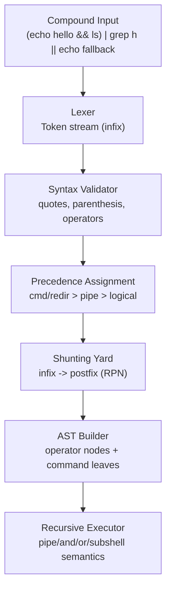
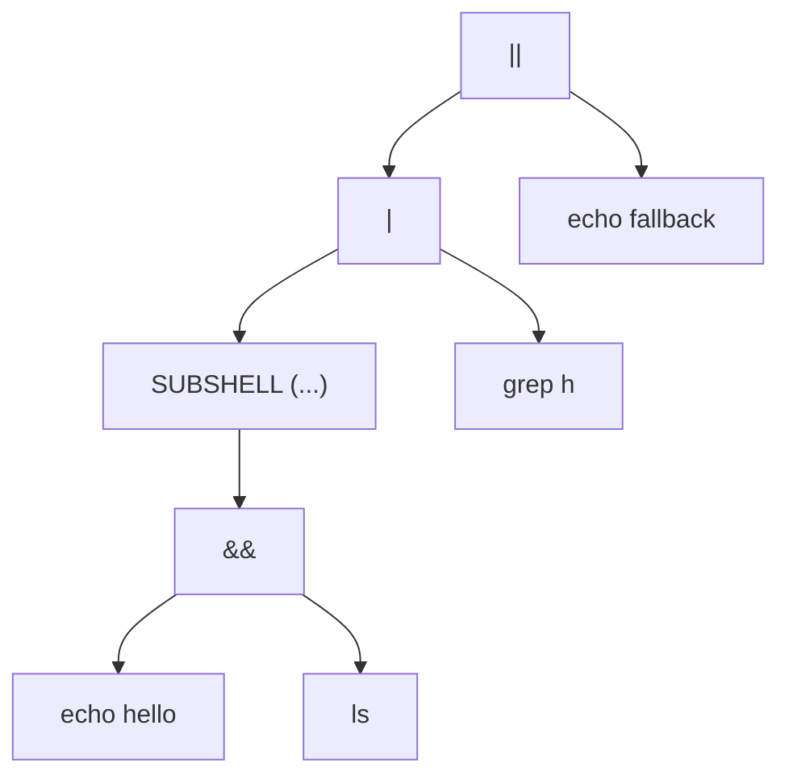

# Minishell

A lightweight UNIX shell written in C as part of the 42 curriculum, focused on parser design, process control, and systems-level reliability.

## Why This Project Matters

`minishell` is much more than "run command + fork":

- It models a real interpreter pipeline: lexing -> parsing -> AST construction -> expansion -> execution.
- It implements shell-specific semantics (`|`, `&&`, `||`, redirections, heredoc, subshells).
- It deals with low-level OS primitives (`fork`, `pipe`, `dup2`, `waitpid`, signals, file descriptors).
- It is a strong proof of practical Computer Science knowledge for recruiters:
  parsing theory, tree-based evaluation, algorithmic complexity, and memory discipline under constraints.

---

## Feature Set

- Interactive prompt with `readline` history.
- Tokenization with quote-aware scanning.
- Syntax validation (operators, parenthesis, unclosed quotes, redirection shape).
- Infix-to-postfix conversion using the **Shunting Yard algorithm**.
- AST build + recursive execution.
- Builtins: `cd`, `echo`, `env`, `exit`, `export`, `pwd`, `unset`.
- Environment variable expansion (`$VAR`, `$?`) and wildcard handling.
- Redirections: `<`, `>`, `>>`, `<<` (heredoc).
- Pipelines and short-circuit logic: `|`, `&&`, `||`.
- Subshell support using parenthesized expressions.
- Signal behavior aligned with shell UX expectations (`Ctrl-C`, process exit codes).

---

## Architecture Overview




### Repository Modules

- `parser/lexing`: lexical analysis and token creation.
- `parser/parsing`: syntax checks, precedence handling, postfix conversion, AST logic.
- `expander`: variable and wildcard expansion, ambiguous redirect handling, heredoc expansion rules.
- `executor`: command execution, pipelines, logical operators, subshells, redirection FD wiring.
- `builtins`: shell builtins and env mutations.
- `utils`: allocator/GC helpers, lists, signal utilities.

---

## Parsing Theory in Practice

### 1) Lexical Analysis

The lexer scans raw input and emits token nodes (`WORD`, `PIPE`, `AND`, `OR`, `HEREDOC`, etc.) while preserving quote semantics.

### 2) Syntax Validation

Before execution, the parser rejects malformed streams:

- invalid operator adjacency (`|| |`, trailing `&&`, bad pipe boundaries),
- malformed redirections (`>` without filename),
- parenthesis mismatch,
- unclosed single/double quotes.

This fail-fast stage prevents undefined behavior deeper in execution.

### 3) Precedence and Shunting Yard

Tokens are assigned precedence levels, then transformed from infix to postfix (RPN):

- high: command units and redirections,
- medium: pipes,
- low: logical operators.

The **Shunting Yard algorithm** provides deterministic operator handling and naturally respects parenthesis nesting.

### 4) Tree Construction (AST)

Postfix output is turned into an **Abstract Syntax Tree** where:

- leaf nodes represent executable command units,
- internal nodes represent operators (`PIPE`, `AND`, `OR`),
- subshell nodes encapsulate grouped expressions.

This tree enables recursive, semantics-correct execution.

### 5) Recursive Descent Style Evaluation

Execution itself is recursive over the AST:

- evaluate left branch,
- apply operator semantics (pipe / short-circuit),
- conditionally evaluate right branch.

This mirrors recursive descent interpretation patterns used in compiler courses.

---

## Example Execution Tree

Input:

```sh
(echo hello && ls) | grep h || echo fallback
```

Conceptual AST:



---

## Complexity Notes

Let `n` be number of tokens in one command line.

- Lexing: `O(n)`
- Syntax validation: `O(n)`
- Infix -> postfix (Shunting Yard): `O(n)`
- AST build: `O(n)`
- Expansion: typically `O(n)` + filesystem-dependent wildcard costs
- Execution traversal: `O(n)` (excluding syscall/runtime costs of child processes)

Overall parser pipeline remains **linear** in token count, with real-world latency mostly dominated by process creation and I/O.

---

## Performance and Reliability Optimizations

- Pre-execution syntax rejection avoids unnecessary forks.
- Structured precedence handling avoids backtracking-heavy parsing.
- AST recursion simplifies short-circuit behavior (`&&`, `||`) and avoids duplicated logic.
- Dedicated helpers for syscalls improve error propagation and status correctness.
- Centralized memory strategy reduces leak risk across deeply nested command flows.
- Heredoc limits and cleanup routines protect descriptor budget and shell stability.

---

## Difficulties Faced (and Why They Matter)

- **FD lifecycle bugs** in pipes/heredocs:
  subtle leaks only appear under chained/failed flows.
- **Signal semantics**:
  user-facing shell behavior is strict and differs across interactive/non-interactive contexts.
- **Exit-status fidelity**:
  mapping failures/signals to bash-like codes (126/127/130/131) is critical.
- **Edge-case grammar combinations**:
  nested parentheses + redirects + logical operators stress parser correctness.
- **Environment anomalies**:
  handling missing/invalid `PWD`/`OLDPWD`, empty environments, and ambiguous expansions safely.

These are exactly the categories where systems code often fails in production.

---

## What I Learned

- Translating formal parsing ideas into robust low-level C.
- Using **Shunting Yard + AST** as a practical interpreter architecture.
- Designing recursive evaluators with predictable semantics.
- Managing Unix processes, signals, and file descriptors safely.
- Building defensive error-handling paths for every syscall boundary.
- Debugging real shell edge cases by comparing behavior against `bash`.

---

## Academic Value

This project connects several core CS domains:

- **Compilers / Language Processing**: token streams, precedence, grammar constraints, ASTs.
- **Algorithms**: stack/queue transforms (Shunting Yard), tree traversal, complexity analysis.
- **Operating Systems**: process control, descriptor plumbing, signal handling.
- **Software Engineering**: modular design, contract boundaries, failure-oriented testing.

It is an end-to-end exercise in building a language runtime from first principles.

---

## Teamwork and Peer Learning (1337 / 42)

This project was built in a strong peer-learning culture where progress came from collective problem solving, not isolated coding.

- We treated bugs as shared incidents: reproduce together, isolate root cause, assign focused fix tasks, then merge and retest.
- During blockers (FD leaks, signal behavior, exit-code mismatches), we ran short debugging sessions to compare hypotheses and validate quickly.
- Code reviews were practical and frequent: challenge assumptions, simplify logic, and align behavior against bash semantics.
- We maintained momentum by communicating clearly on priorities, splitting work by modules, and helping each other unblock fast.
- The result was better reliability, faster iteration, and a stronger engineering mindset around collaboration under pressure.

---

## Build and Run

```bash
make
./minishell
```

### Useful test ideas

```bash
echo hello | wc -c
cat < infile | grep foo > outfile
(echo one && echo two) || echo fallback
export A="42" && echo $A
<< EOF cat
line
EOF
```

---

## Recruiter Snapshot

If you are reviewing this project as hiring signal, this demonstrates:

- strong C foundations under strict compiler flags,
- practical parser/interpreter architecture skills,
- systems debugging in process-heavy and I/O-heavy code,
- disciplined reasoning about correctness and complexity,
- ability to convert academic algorithms into production-like behavior.
