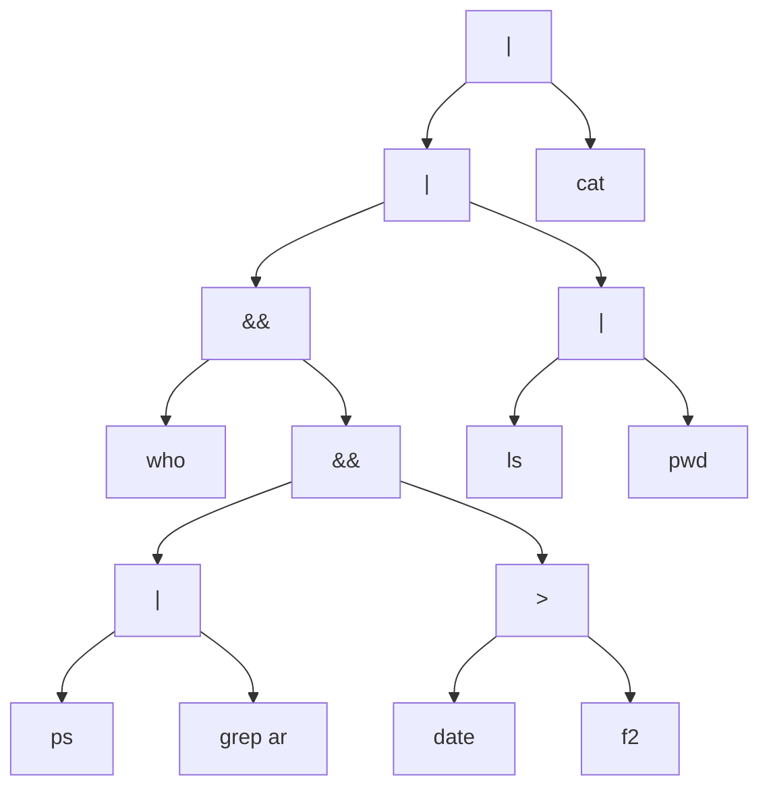

```mermaid
graph TD
    A["|"] --> B["|"]
    A --> C["cat"]
    
    B --> D["&&"]
    B --> E["|"]
    
    D --> F["who"]
    D --> G["&&"]
    
    G --> H["|"]
    G --> I[">"]
    
    H --> J["ps"]
    H --> K["grep ar"]
    
    I --> L["date"]
    I --> M["f2"]
    
    E --> N["ls"]
    E --> O["pwd"]
```